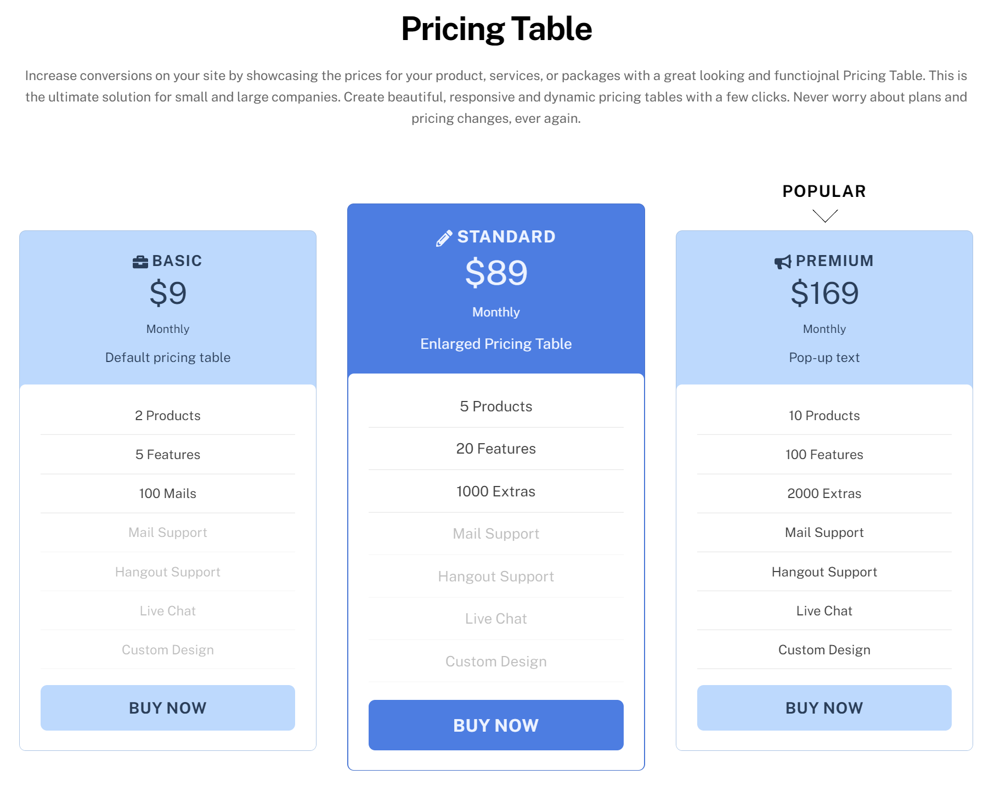

# Fast and Great Converting Pricing Tables, without the headaches.

We have wasted months of work and lots of opportunities with inferior pricing table code or pricing table plugins for Wordpress. 

Here is the solution 

Have we caught your attention? We appreciate your feedback at this early stage of our product. Do not hesitate to contact us. In fact, if your interested, we'd love to give you a tour of the prototype we built.



---

# Prototype

You guessed it! We put our money where our mouth is. This is what we accomplished so far.

Check out this sweet preview. Impressed much, are you?

---

# Imprint & Privacy Policy

Let's keep it simple. This is our contact information:

Pricing Table by Netzweck GmbH
Am langen Felde 12/Top 4
1220 Wien

We take data privacy very seriously, so we make sure not to store anything we do not need. We do not have any tracking service, no cookies or anything like that. If you decide to use the contact form or the newsletter sign up this information will be stored on Netlify, a service we use to host this website. You can approach us any time to have your data removed or simply retrieve information about what information we did store.

---

# Stay in touch

Let's stay in touch. Sign up for our newsletter. Do not worry, we will not bother you with boring details. Expect nice & tight updates about once or twice every 3 months.



